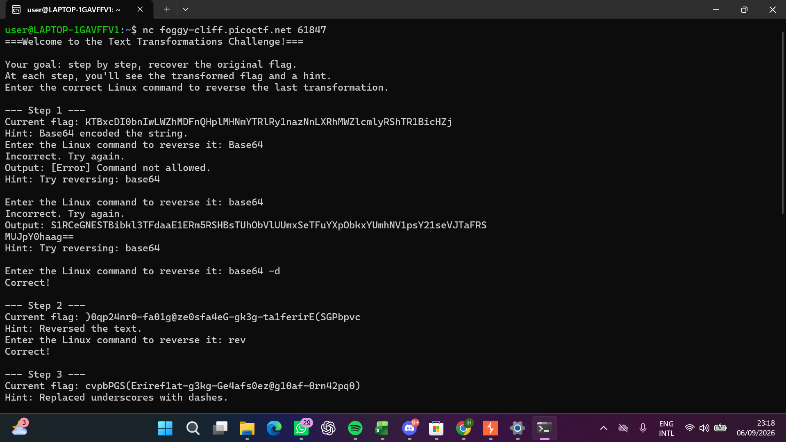
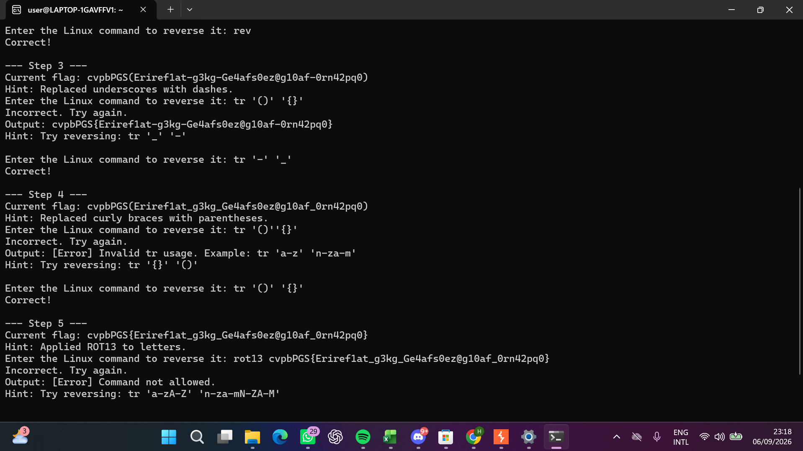
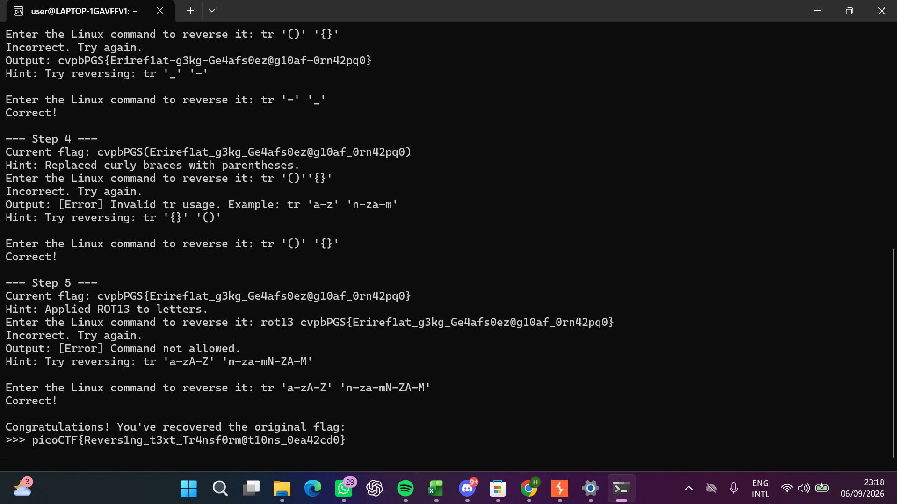
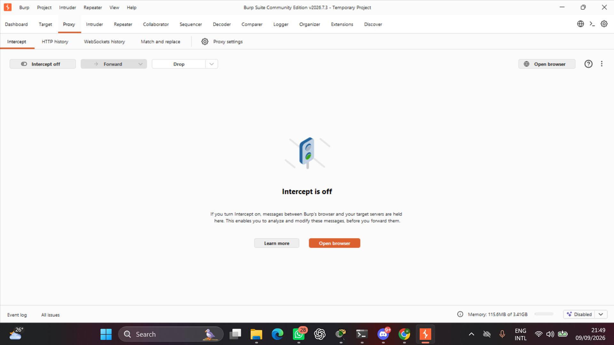
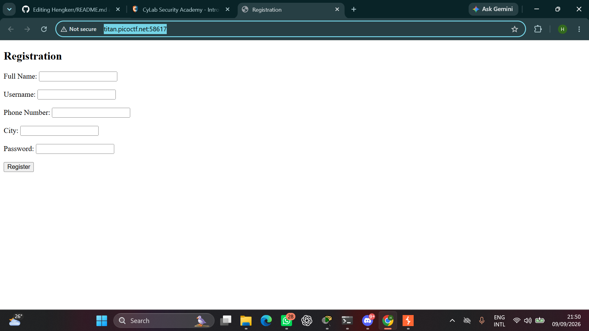
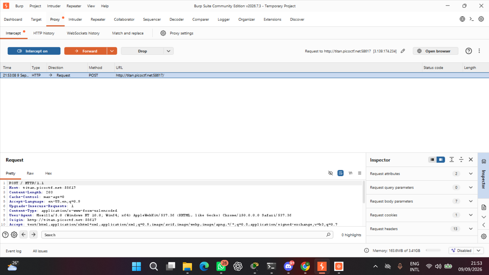
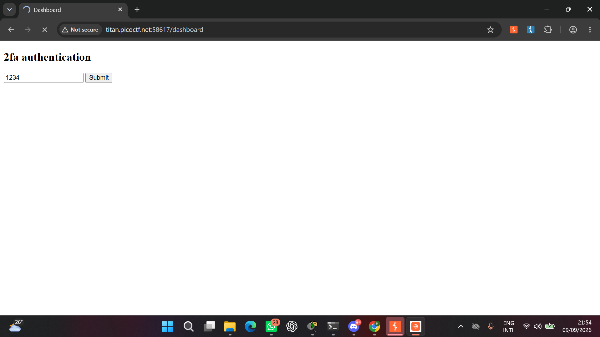
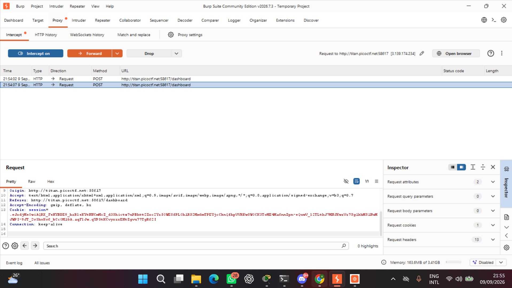
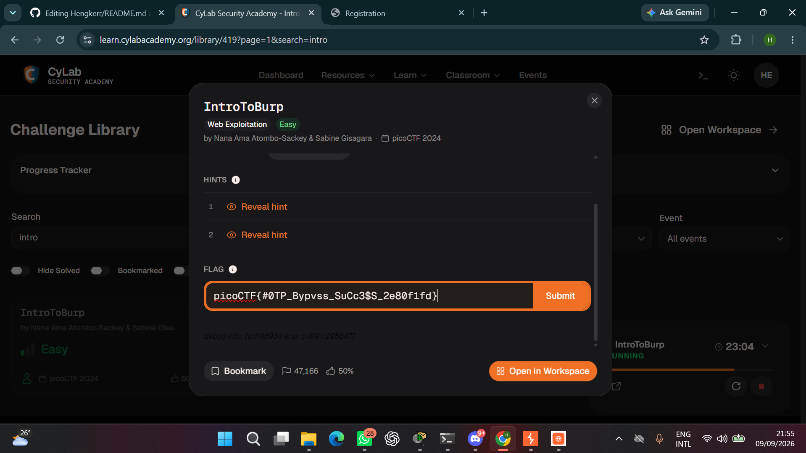

<<<<<<< HEAD
# Hengkerr
=======
Nama : Putu Dodik Putra Wijaya

NIM : 260530911025

Divisi : Cyber Security

Tools yang berhasil di install : Linux Ubuntu, Burp, Python

Langkah-langkah penyelesaian challenge

Melakukan decoding pada string "CHARACTER" menggunakan perintah "base64 -d" untuk mengembalikan string ke bentuk aslinya.

Menggunakan perintah "rev" untuk melakukan reverse atau membalikkan urutan karakter pada teks sehingga diperoleh teks dalam
urutan yang benar

Menggunakan perintah "tr '-' '_ " untuk mengganti seluruh karakter "-" menjadi karakter "_" pada teks.

Menggunakan perintah "tr '()' '{}'" untuk mengganti karakter "(" menjadi "{" dan karakter ")" menjadi "}" pada teks.

Menggunakan perintah "tr 'a-zA-Z' 'n-za-mN-ZA-M'" untuk mengenkripsi atau mendekripsi teks menggunakan metode ROT13 (Rotate 13).
Perintah ini menggeser setiap huruf alfabet sebanyak 13 posisi. Karena alfabet terdiri dari 26 huruf,proses ROT13 yang dilakukan
dua kali akan mengembalikan teks ke bentuk aslinya.

LANGKAH LANGKAH PENGERJAAN IntroToBurp

Download burp dan standby di menu proxy

salin link lalu kita masuk ke tools burp

balik ke burp lalu open browser kemudian paste link

jika sudah submit di web nya,lalu kembali ke tools dan lakukan foward

isi kode otp

hapus otp jangan sampai menghapus baris 16

SELESAIIIIIIIIII 
>>>>> 89a8110 (Week0-CyberSec-TechArt)
